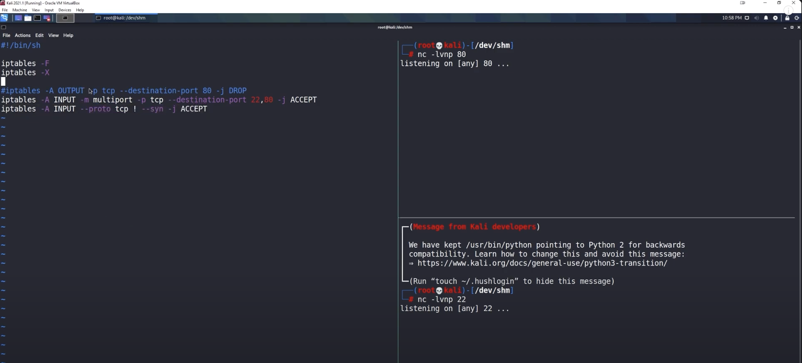
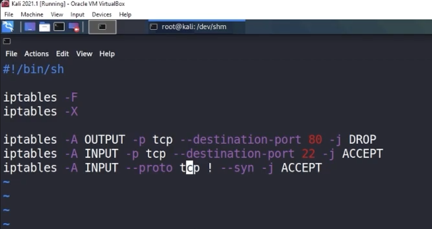
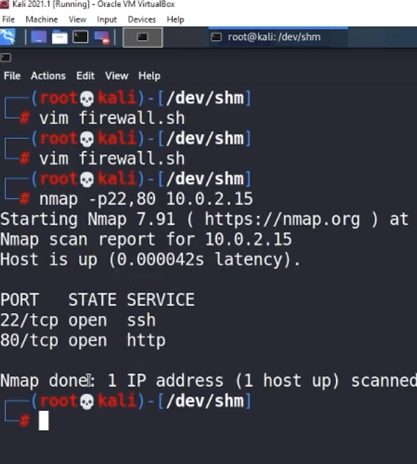
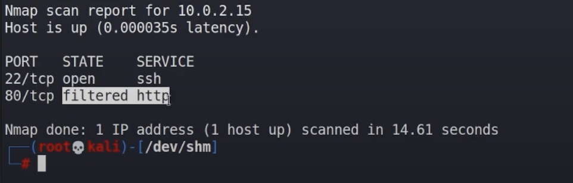

# Exploring-Firewall-Behavior-with-Nmap-Scans
This repository explores firewall behavior with Nmap scans and basic iptables configuration. It demonstrates identifying open and filtered ports, applying interface-specific rules, using port spoofing, and testing proxy routing. Screenshots 📸 and commands provide hands-on examples to understand how firewalls affect network traffic.

Tools: Nmap, Linux VM (or host), iptables/Windows Firewall
Objective: Explore how firewalls affect network scanning, identify open/filtered ports, and practice basic firewall configuration and enumeration techniques.

## 💻Lab Setup
* Environment: Linux VM (VirtualBox)
* Network Mode: NAT / Host-Only / Bridged
* Firewall: iptables
* Notes: Screenshots were taken at each major step for documentation.📸

## 🎯Lab Goals
1. Flush existing firewall rules to start fresh.
2. Open ports 22 (SSH) and 80 (HTTP) to allow TCP responses.
3. Verify open ports using Netcat.
4. Use Nmap to scan and observe how the firewall affects results.
5. Document commands, outputs, and observations with screenshots 📸


## 🛠Commands & Steps

# Step 1: Flush Existing Firewall Rules

Flush all existing rules:  
```bash
sudo iptables -F
```

Delete all user-defined chains:
```bash
sudo iptables -X
```
📸Screenshot showing flushed iptables rules on the left and Netcat listeners on ports 22 and 80 on the right. The Netcat listeners are included to simultaneously verify which ports respond, confirming the firewall state and open ports.


⚡ Observation: All previous firewall rules are cleared. Netcat listeners allow us to check port availability in real time.

# Step 2: Allowing SSH and blocking other TCP
### Example: Allow SSH, block all other incoming TCP traffic

```bash
sudo iptables -A INPUT -p tcp --dport 22 -j ACCEPT
sudo iptables -A INPUT -j DROP
```

### List current rules with verbose output
```bash
sudo iptables -L -v
```
⚡Observation: SSH is allowed, all other incoming TCP traffic blocked.

# Step 3: Open Ports 22 and 80

## Allow incoming TCP on SSH (22) and HTTP (80)
```bash
sudo iptables -A INPUT -p tcp --dport 22 -j ACCEPT
sudo iptables -A INPUT -p tcp --dport 80 -j ACCEPT
```
## Allow responses for established connections
```bash
sudo iptables -A INPUT -m state --state ESTABLISHED,RELATED -j ACCEPT
```
## Drop all other incoming traffic
```bash
sudo iptables -A INPUT -j DROP
```
## List current rules with verbose output
```bash
sudo iptables -L -v
```
📸Screenshot showing the iptables rules applied to block port 80 while allowing port 22.

⚡ Observation: Ports 22 and 80 are open, others blocked.

# Step 4: Verify Open Ports with Netcat
We use Netcat listeners on ports 22 (SSH) and 80 (HTTP) while checking the firewall rules. This allows us to see which ports respond in real time.

## Netcat listener for SSH
```bash
nc -lvnp 22
```
## Netcat listener for HTTP
```bash
nc -lvnp 80
```
📸 Screenshot showing Netcat listeners for ports 22 and 80 alongside the iptables rules. This confirms which ports are open and reachable.



# Step 5: Scan Open Ports with Nmap

## Scan ports 22 and 80 on the target
```bash
nmap -p22,80 10.0.2.15
```
📸Screenshot showing Nmap scan results: port 22 is open (SSH), and port 80 is filtered (HTTP).

